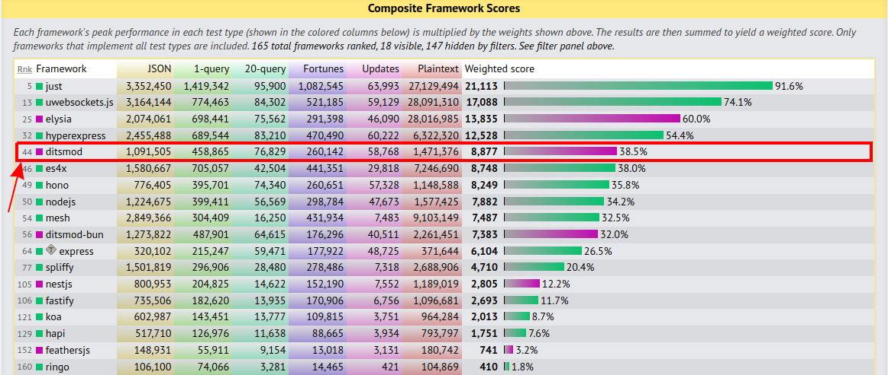

## Why should you try Ditsmod?

Ditsmod is a Node.js-based web framework designed for building highly extensible and fast applications. Another backend JavaScript framework, you say? Well, yes, but what options do we have as we enter 2025 in this stack? Probably 80% of all these frameworks suggest writing routes and middleware in the ExpressJS style. They look very concise when showcasing a "Hello, World!" example, but as soon as you move to even moderately sized projects (like [RealWorld][5]), it becomes a real challenge for the developer. This is one reason why microservices are so popular among these frameworks. Microservices are small, they don't need to organize a lot of code.

But, in today's context, there is already a more modern approach than ExpressJS like frameworks. TypeScript allows you to work not only with a much larger volume of code, it also provides completely new convenient possibilities for working with the IDE, with Dependency Injection.

So, why not just take for example the innovative NestJS and adapt it to your needs? The issue lies in the fact that [NestJS has significant architectural flaws][6]. However, its creator has already written a substantial amount of code for the framework's ecosystem, so making architectural changes could result in breaking changes—something undesirable, especially given the solid user base of NestJS. For context, NestJS hit its [first million weekly downloads in 2021][7], about 4.5 years after the initial commit. By the end of 2024, [NestJS was being downloaded 4 million times a week][9]. In my opinion, this statistic reflects an impressive growth rate for NestJS's user base. At the same time, this rapid growth now hinders architectural changes because the creator is reluctant to risk losing users, often rejecting anything that could introduce breaking changes. For example, the [transition to the ESM standard is not planned anytime soon][8] for this very reason.

Ditsmod began development in 2020, also inspired by Angular v2+. I literally extracted Angular’s Dependency Injection module v4.4.7, which became the backbone of the future **Ditsmod** framework.

For those unfamiliar with Angular, I will try to explain the basic DI concepts borrowed from this framework in a simplified manner. Let's consider the following example:

```ts
class Service1 {}
class Service2 {}

class Service3 {
  constructor(service1: Service1, service2: Service2) {}
}
```

This example shows the `Service3` class, which has two parameters in the constructor. The TypeScript compiler can transfer to the JavaScript code the information that the first place in the constructor of this class is `Service1`, and the second place is `Service2`. For this, you need to use the `injectable` decorator:

```ts
import { injectable } from '@ditsmod/core';

class Service1 {}
class Service2 {}

@injectable()
class Service3 {
  constructor(service1: Service1, service2: Service2) {}
}
```

That's it, now we can get the desired parameter information using the reflector:

```ts
import { reflector } from '@ditsmod/core';

// ...

const rawMeta = reflector.getMetadata(Service3);
console.log(rawMeta?.constructor.params);
```

The mere fact that we can retrieve information about parameters defined in TypeScript code while working in JavaScript elevates the process of creating an instance of `Service3` to a new level. This capability allows us to programmatically "understand" what `Service3` requires in its constructor and automatically inject instances of the exact classes it needs.

It's not necessary to work directly with the reflector to get familiar with Ditsmod, as most of its functionality works under the hood. You simply specify the required dependencies in the constructors of your classes, and Ditsmod automatically uses the reflector to determine what each class requires.

Returning to the comparison with other frameworks, it can be stated that the feature described above is likely unavailable in approximately 80% of all backend frameworks based on JavaScript or TypeScript. While the remaining frameworks do offer Dependency Injection (DI), they do not provide the same level of extensibility, modularity, and encapsulation as Ditsmod.

Up until version 3.0.0, Ditsmod had a small user base, which allowed for numerous breaking changes that introduced essential architectural improvements. Today, Ditsmod is a mature and stable framework. Starting with version 3.0.0, it adopted synchronized package versions, ensuring that any change to a package results in all packages being published with the same new version. Additionally, the entire Ditsmod codebase is written in the ESM format.

- [The English version of the documentation](https://ditsmod.github.io/en/).
- [Українська версія документації](https://ditsmod.github.io/).

## Benchmarks

On the techempower website, you can view [benchmarks for backend frameworks on the JavaScript stack][4]. As you can see, according to the composite score, Ditsmod is the fastest framework that works on the basis of Node.js. Above it are only those frameworks that work on other JavaScript runtimes (Bun, Just-JS, uwebsockets).



## About the repo

This monorepository uses yarn workspaces (see `package.json`).

During you run the following command:

```bash
corepack enable
corepack install
yarn install
```

yarn will create symlinks in `node_modules` for all packages listed in the `packages/*` and `examples/*` folders. Also, modules in the `packages/*` folder are linked to the applications in the `examples/*` folder thanks to [compilerOptions.paths][2] as well as [Project References][3]. So, after any change in the source files in `packages/*`, these changes are automatically reflected in `examples/*`.

Development mode for any application in the `examples/*` directory can be started with this command:

```bash
cd examples/01*
yarn start:dev
```

[1]: https://github.com/angular/angular
[2]: https://www.typescriptlang.org/tsconfig#paths
[3]: https://www.typescriptlang.org/docs/handbook/project-references.html
[4]: https://www.techempower.com/benchmarks/#section=test&runid=967babf5-cf1a-4b3f-a6d0-1cd49ef2c424&hw=ph&test=composite&l=zieepr-67z
[5]: https://github.com/tanem/express-bookshelf-realworld-example-app
[6]: https://dev.to/kostyatretyak/nestjs-vs-ditsmod-injection-scopes-537o
[7]: https://x.com/kammysliwiec/status/1447892571376783360
[8]: https://github.com/nestjs/nest/issues/13817#issuecomment-2245130264
[9]: https://x.com/kammysliwiec/status/1859531066006032394
